# WhatsApp Service

Sistem WhatsApp Service untuk mengelola multi-instance WhatsApp Web client dengan optimasi untuk server produksi.

## Pengembangan Lokal

Untuk menjalankan proyek di lingkungan pengembangan lokal, gunakan docker-compose.local.yml:

```bash
# Copy file .env.local untuk konfigurasi lokal
cp .env.local .env

# Build dan jalankan container untuk pengembangan
docker-compose -f docker-compose.local.yml up -d

# Melihat log secara real-time
docker-compose -f docker-compose.local.yml logs -f
```

Fitur pengembangan lokal:
- Hot-reload dengan Nodemon
- Debug port pada 9229 (dapat diakses dengan Chrome DevTools)
- MySQL database lokal 
- Volume terpisah untuk sesi WhatsApp

## Optimasi yang Diterapkan

### Manajemen Memori dan Resource
- Batasan heap memory Node.js: `--max-old-space-size=1024`
- Monitoring penggunaan memori otomatis
- Auto-disconnect klien tidak aktif ketika memori tinggi

### Konfigurasi Puppeteer yang Dioptimalkan
- Menggunakan Chromium yang sudah terinstal
- Shared memory (shm) yang cukup untuk Chromium
- Disable fitur yang tidak dibutuhkan untuk mengurangi penggunaan memori

### Penanganan Error yang Lebih Baik
- Circuit breaker untuk request external
- Timeout untuk semua operasi network
- Penanganan error yang lebih robust

### Health Check dan Monitoring
- Endpoint `/health` untuk pemeriksaan kesehatan
- Monitoring penggunaan memori dan disk
- Sistem logging yang lebih baik

## Menjalankan di Lingkungan Produksi

### Menggunakan Docker Compose

```bash
# Build dan jalankan container
docker-compose up -d

# Lihat logs
docker-compose logs -f

# Restart service jika diperlukan
docker-compose restart api
```

### Backup Volume WhatsApp Sessions

Script backup `backup-whatsapp-sessions.sh` sudah disediakan untuk backup rutin. Jalankan script ini dengan cron job:

```bash
# Edit crontab
crontab -e

# Tambahkan baris berikut untuk backup setiap hari jam 2 pagi
0 2 * * * /path/to/backup-whatsapp-sessions.sh >> /var/log/whatsapp-backup.log 2>&1
```

## Konfigurasi dengan Environment Variables

Konfigurasi dapat disesuaikan dengan environment variables:

```
# Jumlah klien bersamaan
MAX_CONCURRENT_CLIENTS=10

# Ukuran heap memory Node.js
NODE_OPTIONS=--max-old-space-size=1024

# URL Assistant API
ASSISTANT_URL=https://agent.airabot.id
```

## Monitoring dan Troubleshooting

### Log

```bash
# Lihat logs container
docker logs node-api

# Lihat logs aplikasi
docker exec -it node-api cat /app/logs/app.log
```

### Cek Status Memory

```bash
# Cek penggunaan memori
docker stats node-api
```

### Health Check API

```bash
# Cek status layanan
curl http://localhost:3000/health
```

## Tips Performa Optimal

1. Batasi jumlah klien WhatsApp aktif bersamaan
2. Atur ulang koneksi setiap 24 jam untuk menghindari memory leak
3. Pantau penggunaan memori, dan restart jika mendekati batas
4. Backup secara rutin volume whatsapp_sessions
5. Gunakan health check untuk pemantauan otomatis

## Deskripsi Proyek
Proyek ini menggunakan Framework yang digunakan adalah Express.js dan bahasa pemrograman yang digunakan adalah JavaScript. Express.js adalah framework untuk Node.js yang digunakan untuk membangun aplikasi web. dan bahasa pemrograman Tidak terdeteksi.

## Struktur Proyek
```
.gitignore
.gitlab-ci.yml
README.md
dashboard/.dockerignore
dashboard/Dockerfile
dashboard/index.js
dashboard/package-lock.json
dashboard/package.json
dashboard/public/css/auth.css
dashboard/public/css/styles.css
dashboard/public/js/main.js
dashboard/public/templates/template_pesan.txt
dashboard/public/templates/template_wa_blast.xlsx
dashboard/routes/auth.js
dashboard/routes/blast.js
dashboard/routes/dashboard.js
dashboard/routes/history.js
dashboard/routes/ocr.js
dashboard/routes/openai.js
dashboard/routes/profile.js
dashboard/routes/scan.js
dashboard/views/auth/login.ejs
dashboard/views/auth/register.ejs
dashboard/views/blast/file.ejs
dashboard/views/blast/image.ejs
dashboard/views/blast/index.ejs
dashboard/views/blast/pesan.ejs
dashboard/views/dashboard/index.ejs
dashboard/views/error.ejs
dashboard/views/history/index.ejs
dashboard/views/layouts/main.ejs
dashboard/views/loading.ejs
dashboard/views/ocr/index.ejs
dashboard/views/openai/index.ejs
dashboard/views/profile/index.ejs
dashboard/views/scan/clientStatus.ejs
dashboard/views/scan/index.ejs
dashboard/views/scan/scanQR.ejs
dashboard/views/scan/testScan.ejs
dashboard/views/success.ejs
docker-compose.yml
ecosystem.config.js
mysql-init/01_created_received_data_table.sql
node-api/.dockerignore
node-api/Dockerfile
node-api/config/db.js
node-api/controllers/authController.js
node-api/controllers/dataController.js
node-api/controllers/historyController.js
node-api/controllers/ocrController.js
node-api/index.js
node-api/models/receivedData.js
node-api/models/results.js
node-api/models/session.js
node-api/models/users.js
node-api/package-lock.json
node-api/package.json
node-api/routes/authRoutes.js
node-api/routes/dataRoutes.js
node-api/routes/historyRoutes.js
node-api/routes/ocrRoutes.js
node-api/services/openaiController.js
node-api/services/openaiService.js
node-api/services/prompt.txt
node-api/services/updateSession.js
node-api/services/wa_client.js
node-api/utils/queue.js
node-api/websocket/handlers/checkStatusHandler.js
node-api/websocket/handlers/disconnectHandler.js
node-api/websocket/handlers/initializeHandler.js
node-api/websocket/handlers/openaiHandler.js
node-api/websocket/handlers/sendFileMessagesHandler.js
node-api/websocket/handlers/sendMessagesHandler.js
node-api/websocket/websocket.js
```

## Visualisasi Struktur

### Mermaid.js Diagram

```mermaid
graph TD
dashboard --> .dockerignore
dashboard --> Dockerfile
dashboard --> index.js
dashboard --> package-lock.json
dashboard --> package.json
dashboard --> public
public --> css
css --> auth.css
dashboard --> public
public --> css
css --> styles.css
dashboard --> public
public --> js
js --> main.js
dashboard --> public
public --> templates
templates --> template_pesan.txt
dashboard --> public
public --> templates
templates --> template_wa_blast.xlsx
dashboard --> routes
routes --> auth.js
dashboard --> routes
routes --> blast.js
dashboard --> routes
routes --> dashboard.js
dashboard --> routes
routes --> history.js
dashboard --> routes
routes --> ocr.js
dashboard --> routes
routes --> openai.js
dashboard --> routes
routes --> profile.js
dashboard --> routes
routes --> scan.js
dashboard --> views
views --> auth
auth --> login.ejs
dashboard --> views
views --> auth
auth --> register.ejs
dashboard --> views
views --> blast
blast --> file.ejs
dashboard --> views
views --> blast
blast --> image.ejs
dashboard --> views
views --> blast
blast --> index.ejs
dashboard --> views
views --> blast
blast --> pesan.ejs
dashboard --> views
views --> dashboard
dashboard --> index.ejs
dashboard --> views
views --> error.ejs
dashboard --> views
views --> history
history --> index.ejs
dashboard --> views
views --> layouts
layouts --> main.ejs
dashboard --> views
views --> loading.ejs
dashboard --> views
views --> ocr
ocr --> index.ejs
dashboard --> views
views --> openai
openai --> index.ejs
dashboard --> views
views --> profile
profile --> index.ejs
dashboard --> views
views --> scan
scan --> clientStatus.ejs
dashboard --> views
views --> scan
scan --> index.ejs
dashboard --> views
views --> scan
scan --> scanQR.ejs
dashboard --> views
views --> scan
scan --> testScan.ejs
dashboard --> views
views --> success.ejs
mysql-init --> 01_created_received_data_table.sql
node-api --> .dockerignore
node-api --> Dockerfile
node-api --> config
config --> db.js
node-api --> controllers
controllers --> authController.js
node-api --> controllers
controllers --> dataController.js
node-api --> controllers
controllers --> historyController.js
node-api --> controllers
controllers --> ocrController.js
node-api --> index.js
node-api --> models
models --> receivedData.js
node-api --> models
models --> results.js
node-api --> models
models --> session.js
node-api --> models
models --> users.js
node-api --> package-lock.json
node-api --> package.json
node-api --> routes
routes --> authRoutes.js
node-api --> routes
routes --> dataRoutes.js
node-api --> routes
routes --> historyRoutes.js
node-api --> routes
routes --> ocrRoutes.js
node-api --> services
services --> openaiController.js
node-api --> services
services --> openaiService.js
node-api --> services
services --> prompt.txt
node-api --> services
services --> updateSession.js
node-api --> services
services --> wa_client.js
node-api --> utils
utils --> queue.js
node-api --> websocket
websocket --> handlers
handlers --> checkStatusHandler.js
node-api --> websocket
websocket --> handlers
handlers --> disconnectHandler.js
node-api --> websocket
websocket --> handlers
handlers --> initializeHandler.js
node-api --> websocket
websocket --> handlers
handlers --> openaiHandler.js
node-api --> websocket
websocket --> handlers
handlers --> sendFileMessagesHandler.js
node-api --> websocket
websocket --> handlers
handlers --> sendMessagesHandler.js
node-api --> websocket
websocket --> websocket.js
```


### Dependency Graph


## Framework dan Bahasa Pemrograman
- **Framework**: Framework yang digunakan adalah Express.js dan bahasa pemrograman yang digunakan adalah JavaScript. Express.js adalah framework untuk Node.js yang digunakan untuk membangun aplikasi web.
- **Bahasa Pemrograman Utama**: Tidak terdeteksi

## Teknologi yang Digunakan

- Docker Compose

## Routes
```
Berikut deteksi semua routes, metode HTTP, path, dan parameter dari isi file di atas:

1. Route:
   - Metode HTTP: GET
   - Path: '/'
   - Parameter: tidak ada

2. Route:
   - Metode HTTP: USE
   - Path: '/dashboard'
   - Parameter: req, res, next, isAuthenticated, dashboardRoutes

3. Route:
   - Metode HTTP: USE
   - Path: '/history'
   - Parameter: req, res, next, isAuthenticated, historyRoutes

4. Route:
   - Metode HTTP: USE
   - Path: '/blast'
   - Parameter: req, res, next, isAuthenticated, blastRoutes

5. Route:
   - Metode HTTP: USE
   - Path: '/scan'
   - Parameter: req, res, next, isAuthenticated, scanRoutes

6. Route:
   - Metode HTTP: USE
   - Path: '/openai'
   - Parameter: req, res, next, isAuthenticated, openaiRoutes

7. Route:
   - Metode HTTP: USE
   - Path: '/ocr'
   - Parameter: req, res, next, isAuthenticated, ocrRoutes

8. Route:
   - Metode HTTP: USE
   - Path: '/profile'
   - Parameter: req, res, next, isAuthenticated, profileRoutes

9. Route:
   - Metode HTTP: USE
```

## Instruksi Eksekusi Routes
### Berikut deteksi semua routes metode HTTP
Contoh CURL:
```bash
curl -X Berikut deteksi semua routes 'http://localhost:5000metode HTTP'
```
Route tidak dikenali: 
Route tidak dikenali: 1. Route:
Route tidak dikenali:    - Metode HTTP: GET
Route tidak dikenali:    - Path: '/'
Route tidak dikenali:    - Parameter: tidak ada
Route tidak dikenali: 
Route tidak dikenali: 2. Route:
Route tidak dikenali:    - Metode HTTP: USE
Route tidak dikenali:    - Path: '/dashboard'
###    - Parameter: req res
Contoh CURL:
```bash
curl -X    - Parameter: req 'http://localhost:5000res'
```
Route tidak dikenali: 
Route tidak dikenali: 3. Route:
Route tidak dikenali:    - Metode HTTP: USE
Route tidak dikenali:    - Path: '/history'
###    - Parameter: req res
Contoh CURL:
```bash
curl -X    - Parameter: req 'http://localhost:5000res'
```
Route tidak dikenali: 
Route tidak dikenali: 4. Route:
Route tidak dikenali:    - Metode HTTP: USE
Route tidak dikenali:    - Path: '/blast'
###    - Parameter: req res
Contoh CURL:
```bash
curl -X    - Parameter: req 'http://localhost:5000res'
```
Route tidak dikenali: 
Route tidak dikenali: 5. Route:
Route tidak dikenali:    - Metode HTTP: USE
Route tidak dikenali:    - Path: '/scan'
###    - Parameter: req res
Contoh CURL:
```bash
curl -X    - Parameter: req 'http://localhost:5000res'
```
Route tidak dikenali: 
Route tidak dikenali: 6. Route:
Route tidak dikenali:    - Metode HTTP: USE
Route tidak dikenali:    - Path: '/openai'
###    - Parameter: req res
Contoh CURL:
```bash
curl -X    - Parameter: req 'http://localhost:5000res'
```
Route tidak dikenali: 
Route tidak dikenali: 7. Route:
Route tidak dikenali:    - Metode HTTP: USE
Route tidak dikenali:    - Path: '/ocr'
###    - Parameter: req res
Contoh CURL:
```bash
curl -X    - Parameter: req 'http://localhost:5000res'
```
Route tidak dikenali: 
Route tidak dikenali: 8. Route:
Route tidak dikenali:    - Metode HTTP: USE
Route tidak dikenali:    - Path: '/profile'
###    - Parameter: req res
Contoh CURL:
```bash
curl -X    - Parameter: req 'http://localhost:5000res'
```
Route tidak dikenali: 
Route tidak dikenali: 9. Route:
Route tidak dikenali:    - Metode HTTP: USE

## Cara Menjalankan Proyek
Berikut adalah instruksi langkah demi langkah untuk menjalankan proyek:

1. **Clone repository proyek ke komputer lokal Anda**

    Buka terminal dan gunakan perintah `git clone` dengan URL repositori proyek. Misalnya:

    ```
    git clone https://gitlab.com/namauser/namaproyek.git
    ```

    Beralih ke direktori proyek yang baru saja di-clone.

    ```
    cd namaproyek
    ```

2. **Instal Node.js dan npm**

    Proyek ini menggunakan Node.js dan npm (node package manager). Jika belum ada di komputer Anda, silakan instal terlebih dahulu. Anda bisa mengunduh dan menginstal keduanya melalui [situs web resmi Node.js](https://nodejs.org/en/).

3. **Instal Docker dan Docker Compose**

    Proyek ini tampaknya menggunakan Docker dan Docker Compose. Jika belum terinstall di komputer Anda, silakan unduh dan instal melalui [situs web resmi Docker](https://www.docker.com/products/docker-desktop).

4. **Instal Dependensi**

    Beralih ke direktori untuk setiap aplikasi (misalnya, `dashboard` dan `node-api`) dan jalankan `npm install` di setiap direktori untuk menginstal dependensi yang

## Script Bantuan untuk Pengembangan

Untuk memudahkan proses pengembangan dan pengelolaan WhatsApp Service, beberapa script bantuan telah disediakan:

### 1. Pengembangan Lokal

- **`start-local.sh`** - Menjalankan WhatsApp Service di lingkungan pengembangan lokal
  ```
  ./start-local.sh
  ```
  Script ini akan:
  - Menyalin file `.env.local` ke `.env` jika belum ada
  - Membangun dan menjalankan container berdasarkan `docker-compose.local.yml`
  - Menampilkan URL akses dan informasi debug port

- **`stop-local.sh`** - Menghentikan WhatsApp Service
  ```
  ./stop-local.sh
  ```
  Script ini akan menghentikan semua container dan memberikan opsi untuk menghapus volume WhatsApp sessions.

### 2. Backup dan Restore

- **`backup-sessions.sh`** - Membuat backup volume WhatsApp sessions
  ```
  ./backup-sessions.sh
  ```
  Backup akan disimpan di folder `./backups` dengan format nama `whatsapp_sessions_YYYYMMDD_HHMMSS.tar.gz`.
  Script ini secara otomatis hanya menyimpan 5 backup terbaru untuk menghemat ruang disk.

- **`restore-sessions.sh`** - Memulihkan volume WhatsApp sessions dari backup
  ```
  ./restore-sessions.sh
  ```
  Script ini akan menampilkan daftar backup yang tersedia dan meminta pengguna untuk memilih yang ingin dipulihkan.

### 3. Monitoring

- **`monitor.sh`** - Memantau penggunaan resource dari container WhatsApp Service
  ```
  ./monitor.sh [opsi]
  ```
  
  Opsi yang tersedia:
  - `-h, --help` - Menampilkan bantuan
  - `-t, --top` - Menampilkan proses dalam container (menggunakan top)
  - `-s, --stats` - Hanya menampilkan statistik container (tanpa proses)
  - `-i, --interval` - Mengatur interval refresh dalam detik (default: 2)
  
  Contoh penggunaan:
  ```
  ./monitor.sh --top     # Menampilkan statistik dan proses dalam container
  ./monitor.sh -i 5      # Memperbarui data setiap 5 detik
  ```

### Penggunaan di Windows

Untuk menggunakan script-script ini di Windows, Anda dapat menggunakan Git Bash, WSL, atau PowerShell dengan beberapa penyesuaian. Alternatif lain, Anda dapat menjalankan perintah docker-compose secara langsung:

```powershell
# Start (PowerShell)
docker-compose -f docker-compose.local.yml up -d --build

# Stop (PowerShell)
docker-compose -f docker-compose.local.yml down
```

